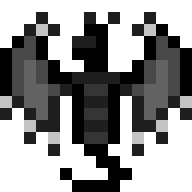
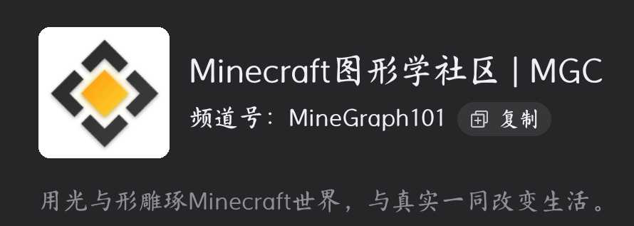

## 渲染龙

- 我的世界渲染龙是基岩版的“渲染龙”是基于基岩版的一个全新的渲染引擎，它的目标是让更低端的设备得到更高的画质体验。
- ==**Render Dragon是在Minecraft 1.16版本中首次加入的**==，随后，对于Windows 10的游戏主机版也在同一版本中加入了这一特性。然而，对于手机版和32位的Windows 10版，它是在Minecraft 1.18.30版本中更新的

- 需要解释的是，目前顶尖的渲染龙是由不知几何大佬和他的团队制作的，延迟渲染技术渣机慎入（本服务器不提供延迟渲染技术的下载，又需求的可以自行去van♂能的互联网上寻找）
- 
- 个别渲染龙可以直接导入或者改包之后再食用，需要渲染龙改包技术支持的可以询问服务器的管理员wzxxyo飒马，他会为你解答疑惑[点击下载]https://source.colorsky.fun:8443/s/Ylhy
## 纹理包   UI 

- ##### **材质包** 
- **纹理包（Texture Pack，旧译为“材质包”）** 是一个可以更改游戏中[方块](https://minecraft.fandom.com/zh/wiki/%E6%96%B9%E5%9D%97 "方块")、[物品](https://minecraft.fandom.com/zh/wiki/%E7%89%A9%E5%93%81 "物品")、[生物](https://minecraft.fandom.com/zh/wiki/%E7%94%9F%E7%89%A9 "生物")和界面纹理贴图的文件包。它们是由png图片和`pack.txt`文件组成的`.zip`压缩包。 纹理贴图的默认分辨率是16×16，但32×32、64×64、128×128、256×256、512×512或更高分辨率的高清纹理包也可以通过第三方[Mods](https://minecraft.fandom.com/zh/wiki/Mods "Mods")加载。

在[Java版1.6.1](https://minecraft.fandom.com/zh/wiki/Java%E7%89%881.6.1 "Java版1.6.1") 中，纹理包被替换为[资源包](https://minecraft.fandom.com/zh/wiki/%E8%B5%84%E6%BA%90%E5%8C%85 "资源包")，提供对纹理和其他游戏功能（如音乐和文本）的更多控制。
- ##### UI
- 那么将上述图标和文字的基本规范和运用都理解了之后，接下来我们来看重点的界面排版设计。UI界面是整体布局的重中之重，这和玩家的实际游戏时长息息相关。
##### 纹理包和UI包の下载
- 我们的服务器为大家整理了有限但是亲测绝对精品的纹理包和UI包供大家免费在线下载食用，希望能够提高大家游玩本服务器的热情，提高大家的持久力
- [纹理包下载链接🔗]https://source.colorsky.fun:8443/s/AVH7 [UI包の下载链接🔗]https://source.colorsky.fun:8443/s/1XTl
- 以上文本由本服务器至诚至善至美至纯的wzxxyo编辑，有问题的欢迎补充

